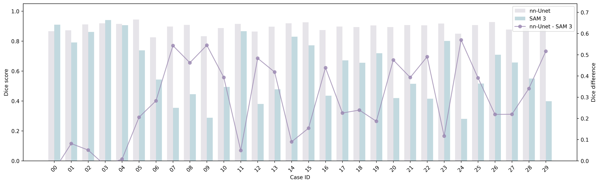
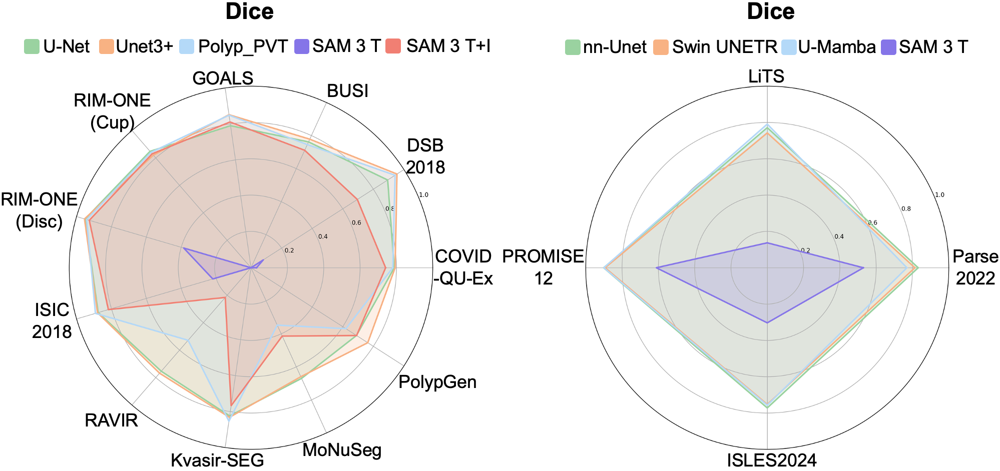
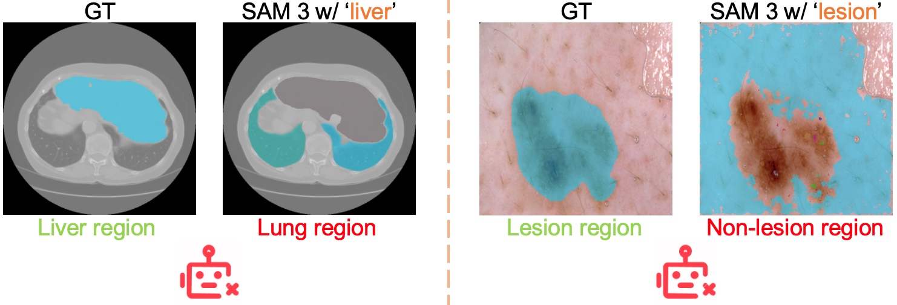
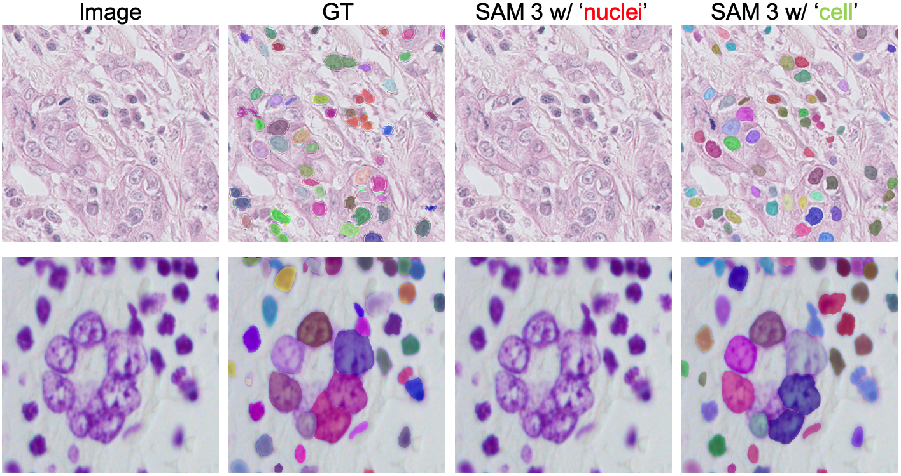

# MedSAM3
MedSAM3: Delving into Segment Anything with Medical Concepts

[](https://arxiv.org/abs/2511.19046)

**🚧 Code, model, paper, and guides will be released progressively! 🚧**

## Overview
MedSAM-3 is a text-promptable medical segmentation foundation model that enables **Promptable Concept Segmentation (PCS)** across diverse medical imaging modalities (X-ray, MRI, Ultrasound, CT, OCT, Fundus, Dermoscopy, Histopathology, and video).

### Key Features
- 🔤 **Text-Driven Segmentation**: Segment using natural language (e.g., "breast tumor", "pulmonary artery")
- 🎯 **Multi-Modal Support**: Works across diverse medical imaging modalities
- 🤖 **MedSAM-3 Agent**: Integrates MLLMs for complex reasoning
- 📈 **SOTA Performance**: Outperforms existing models

## Overview
<div align="center">
  
  <p><i>Concept-driven medical segmentation across multiple modalities</i></p>
</div>

## Architecture
<div align="center">
  
</div>

## MedSAM-3 Agent
<div align="center">
  
</div>

## Performance
| Dataset | U-Net | MedSAM | SAM 3 | **MedSAM-3** |
|---------|-------|--------|-------|--------------|
| BUSI | 0.7618 | 0.7514 | 0.7110 | **0.7772** |
| RIM-ONE | 0.8480 | 0.8479 | 0.8303 | **0.8977** |
| ISIC 2018 | 0.8760 | **0.9177** | 0.8178 | 0.9058 |
| Kvasir-SEG | 0.8244 | 0.7657 | 0.7671 | **0.8831** |


## TODO List
- [x] Release paper on arXiv ([Paper Link](https://arxiv.org/abs/2511.19046))
- [ ] Release MedSAM-3 model weights
- [ ] Release training code
- [ ] Release inference code
- [ ] Release evaluation scripts
- [ ] Publish comprehensive documentation
- [ ] Create tutorial notebooks

## Tips and Future Directions
We are continuously working to improve MedSAM-3:
- 📊 **Scaling Up**: We are progressively expanding the training data scale to cover more medical concepts and imaging modalities
- 🔧 **Method Updates**: The model architecture and training strategies will be iteratively refined based on community feedback and new research findings
- 🌐 **Towards Universal Medical Segmentation**: Our ultimate goal is to develop a universal medical image segmentation foundation model that can handle any anatomical structure or pathological finding across all medical imaging modalities

## Discussion: SAM 3 Limitations on Medical Data
While SAM 3 shows impressive performance on natural images, we observed several failure cases on medical imaging data:


**Example Observations:**

1. **Substantial Performance Discrepancy Between SAM 3 and Established Medical Segmentation Baselines**: Across all evaluated datasets, SAM 3 shows a large and unusual performance gap compared with standard medical segmentation models. This pattern is consistent across 2D, video, and 3D tasks. A representative example is the PROMISE12 dataset. Although PROMISE12 has clear anatomy and minimal semantic ambiguity, some are segmented reasonably well while many others fail severely among the 30 test cases
<div align="center">
  
</div>
<div align="center">
  
</div>


2. **Systematic Misalignment Between Concept Prompts and Anatomical Target Regions in SAM 3**: liver vs lung? lesion vs non-lesion?
<div align="center">
  
</div>


3. **Limited Semantic Discrimination of Fine-Grained Medical Terminology by SAM 3**: nuclei vs cell?
<div align="center">
  
</div>


These limitations motivate the development of MedSAM-3, which incorporates medical domain knowledge and is specifically trained on diverse medical imaging data.

## Paper
📄 **[MedSAM-3: Delving into Segment Anything with Medical Concepts](https://arxiv.org/abs/2511.19046)**

If you find MedSAM-3 useful in your research, please consider citing:
```bibtex
@article{medsam3_2024,
  title={MedSAM-3: Delving into Segment Anything with Medical Concepts},
  author={[Authors]},
  journal={arXiv preprint arXiv:2511.19046},
  year={2024}
}
```

## Coming Soon
- 💻 Code
- 💾 Model weights
- 📦 Installation guide
- 📚 Documentation

## Contact
For questions, please contact:
- Jintai Chen: jintaiCHEN@hkust-gz.edu.cn
- Xu Cao: xucao2@illinois.edu

---
<div align="center">
Made with ❤️ by the MedSAM-3 Team
</div>
