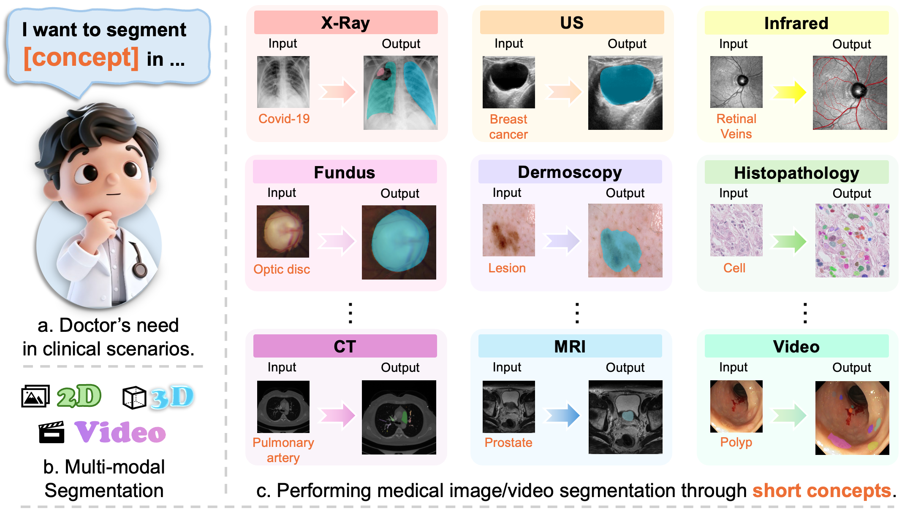
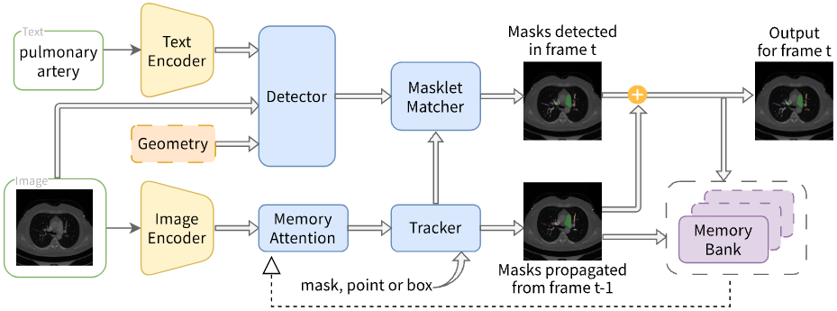

# MedSAM3
MedSAM3: Delving into Segment Anything with Medical Concepts

**🚧 Code, models, and paper coming soon! 🚧**

## Overview

MedSAM-3 is a text-promptable medical segmentation foundation model that enables **Promptable Concept Segmentation (PCS)** across diverse medical imaging modalities (X-ray, MRI, Ultrasound, CT, OCT, Fundus, Dermoscopy, Histopathology, and video).

### Key Features

- 🔤 **Text-Driven Segmentation**: Segment using natural language (e.g., "breast tumor", "pulmonary artery")
- 🎯 **Multi-Modal Support**: Works across 10+ medical imaging modalities
- 🤖 **MedSAM-3 Agent**: Integrates MLLMs for complex reasoning
- 📈 **SOTA Performance**: Outperforms existing models

## Demo

  
  
<i>Concept-driven medical segmentation across multiple modalities</i>

## Architecture

  

## Performance

| Dataset | U-Net | MedSAM | SAM 3 | **MedSAM-3** |
|---------|-------|--------|-------|--------------|
| BUSI | 0.7618 | 0.7514 | 0.7110 | **0.7772** |
| RIM-ONE | 0.8480 | 0.8479 | 0.8303 | **0.8977** |
| ISIC 2018 | 0.8760 | 0.9177 | 0.8178 | **0.9058** |
| Kvasir-SEG | 0.8244 | 0.7657 | 0.7671 | **0.8831** |

## Coming Soon

- 📄 Paper
- 💻 Code
- 💾 Model weights
- 📦 Installation guide
- 📚 Documentation

## Contact

For questions, please contact:
- Jintai Chen: jintaiCHEN@hkust-gz.edu.cn
- Xu Cao: xucao2@illinois.edu

---

Made with ❤️ by the MedSAM-3 Team

